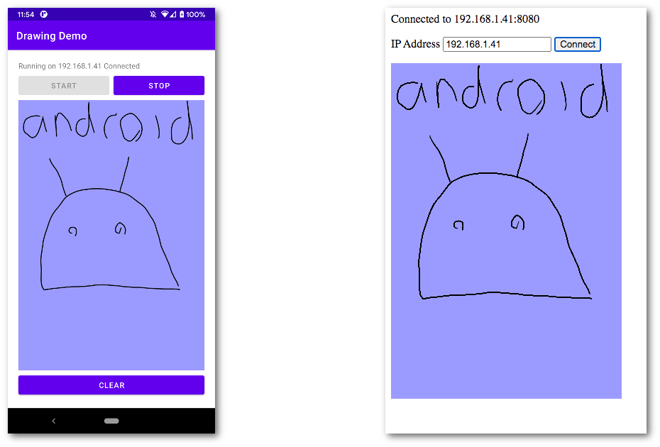

# websocket-demo

This app and website combination demonstrate the potential of web sockets on Android.

## Setup

1. Checkout the project

2. Run the app as usual and click the start button. You'll see a message "Running on xxx.xxx.xxx.xxx. Disconnected" with your phone's ip address.

3. Make sure your desktop machine is connected to the same WiFi point as your phone

4. In a browser (I've tested with Chrome and Safari), navigate to the project and open `client.html` i.e. `file:///{project root}/web/client.html`

5. Enter the ip address from above in the box and click connect. 

6. After a pause you'll be able to draw on the handset and see the drawing appear in your browser

